# Class Diagram - Membership Program

## 📊 Complete Class Diagram

```mermaid
classDiagram
    %% Enums
    class MembershipType {
        <<enumeration>>
        STANDARD
        LOYAL
        VIP
    }
    
    class MembershipTier {
        <<enumeration>>
        SILVER
        GOLD
        PLATINUM
    }
    
    class PlanType {
        <<enumeration>>
        MONTHLY
        QUARTERLY
        YEARLY
    }
    
    class SubscriptionStatus {
        <<enumeration>>
        ACTIVE
        CANCELED
        EXPIRED
    }
    
    class DiscountType {
        <<enumeration>>
        PERCENT
        FLAT
    }

    %% Core Models
    class MembershipPlan {
        -String id
        -MembershipType membershipType
        -PlanType planType
        -MembershipTier tier
        -BigDecimal price
        -TierBenefits tierBenefits
        +getId()
        +getMembershipType()
        +getPlanType()
        +getTier()
        +getPrice()
        +getTierBenefits()
    }
    
    class Subscription {
        -String id
        -String userId
        -PlanType planType
        -MembershipType membershipType
        -MembershipTier tier
        -LocalDate startDate
        -LocalDate endDate
        -SubscriptionStatus status
        +getters/setters
    }
    
    class TierBenefits {
        -MembershipTier tier
        -FreeDeliveryRule freeDeliveryRule
        -List~DiscountRule~ discountRules
        -List~CouponRule~ couponRules
        +getTier()
        +getFreeDeliveryRule()
        +getDiscountRules()
        +getCouponRules()
    }
    
    class BenefitConfig {
        -Map~String,TierBenefits~ benefitsByMembershipAndTier
        +addTierBenefits(MembershipType, TierBenefits)
        +getBenefitsForMembershipAndTier(MembershipType, MembershipTier)
    }
    
    class DiscountRule {
        -DiscountType type
        -BigDecimal value
        -Set~String~ applicableProductIds
        -Set~String~ applicableCategoryIds
    }
    
    class FreeDeliveryRule {
        -BigDecimal minOrderAmount
    }
    
    class CouponRule {
        -String code
        -DiscountRule discountRule
    }
    
    class PlanKey {
        -MembershipType membershipType
        -PlanType planType
        -MembershipTier tier
        +equals()
        +hashCode()
    }

    %% Repository Layer
    class PlanRepository {
        -Map~PlanKey,MembershipPlan~ planKeyToPlan
        +getAllPlans()
        +getByKey(MembershipType, PlanType, MembershipTier)
        +getByPlanType(PlanType)
    }
    
    class SubscriptionRepository {
        -ConcurrentMap~String,Subscription~ userIdToSubscription
        +findByUserId(String)
        +save(Subscription)
        +findAll()
    }
    
    class TierConfigRepository {
        -Map~MembershipTier,Integer~ tierToExtraDiscount
        +getExtraDiscountForTier(MembershipTier)
    }

    %% Builder Pattern
    class TierBenefitsBuilder {
        -MembershipTier tier
        -BigDecimal minOrderForFreeDelivery
        -List~DiscountRule~ discountRules
        -List~CouponRule~ couponRules
        +withTier(MembershipTier)
        +withFreeDeliveryThreshold(BigDecimal)
        +withFreeDeliveryAlways()
        +addPercentDiscount(BigDecimal, Set~String~)
        +addFlatDiscount(BigDecimal, Set~String~)
        +addCoupon(String, DiscountType, BigDecimal)
        +build() TierBenefits
    }
    
    class BenefitConfigBuilder {
        -BenefitConfig config
        +addTierBenefits(MembershipType, TierBenefits)
        +addAllMembershipTypes(MembershipTier, TierBenefits, TierBenefits, TierBenefits)
        +build() BenefitConfig
    }

    %% Factory Pattern
    class BenefitConfigurationFactory {
        +createForPlanType(PlanType) BenefitConfig
        -createStandardBenefits(MembershipTier, PlanType) TierBenefits
        -createLoyalBenefits(MembershipTier, PlanType) TierBenefits
        -createVipBenefits(MembershipTier, PlanType) TierBenefits
        -getDiscountForTier(PlanType, int) BigDecimal
        -getCouponCode(PlanType, String) String
    }
    
    class PlanFactory {
        -BenefitConfigurationFactory benefitFactory
        -PriceCalculator priceCalculator
        +createAllPlans() List~MembershipPlan~
        -generatePlanId(MembershipType, PlanType, MembershipTier) String
    }
    
    class PriceCalculator {
        +calculate(PlanType, MembershipType, MembershipTier) BigDecimal
        -getBasePrice(PlanType) BigDecimal
        -getMembershipMultiplier(MembershipType) BigDecimal
        -getTierMultiplier(MembershipTier) BigDecimal
    }

    %% Service Layer
    class PlanService {
        -PlanRepository planRepository
        +getAllPlans() List~MembershipPlan~
        +getPlan(MembershipType, PlanType, MembershipTier) MembershipPlan
        +getPlansByType(PlanType) List~MembershipPlan~
    }
    
    class SubscriptionService {
        -SubscriptionRepository subscriptionRepository
        -PlanService planService
        -TierEvaluationStrategy tierEvaluationStrategy
        -ConcurrentMap~String,Lock~ userLocks
        +subscribe(String, PlanType, MembershipType, MembershipTier) Subscription
        +getCurrent(String) Optional~Subscription~
        +upgradeTier(String, MembershipTier) Optional~Subscription~
        +downgradeTier(String, MembershipTier) Optional~Subscription~
        +cancel(String) Optional~Subscription~
        +expireDueSubscriptions() int
        -getHighestQualifyingTier(String, MembershipType) MembershipTier
        -isTierHigher(MembershipTier, MembershipTier) boolean
        -lockForUser(String) Lock
    }
    
    class BenefitService {
        -TierConfigRepository tierConfigRepository
        +effectiveBenefits(MembershipPlan) TierBenefits
        +effectiveBenefits(MembershipPlan, MembershipType, MembershipTier) TierBenefits
        -mergeDiscounts(TierBenefits, DiscountRule) List~DiscountRule~
    }
    
    class SubscriptionExpiryScheduler {
        -SubscriptionService subscriptionService
        -ScheduledExecutorService scheduler
        +start(long, long)
        +stop()
    }

    %% Strategy Pattern
    class TierEvaluationStrategy {
        <<interface>>
        +qualifies(String, MembershipTier) boolean
    }
    
    class OrderCountBasedStrategy {
        -Map~MembershipTier,Integer~ thresholdByTier
        -Map~String,Integer~ userMonthlyOrderCount
        +qualifies(String, MembershipTier) boolean
    }
    
    class MonthlySpendBasedStrategy {
        -Map~MembershipTier,BigDecimal~ thresholdByTier
        -Map~String,BigDecimal~ userMonthlySpend
        +qualifies(String, MembershipTier) boolean
    }
    
    class CohortBasedStrategy {
        -Map~String,Set~String~~ userToCohorts
        -Map~MembershipTier,String~ requiredCohortByTier
        +qualifies(String, MembershipTier) boolean
    }
    
    class CompositeTierEvaluationStrategy {
        -List~TierEvaluationStrategy~ strategies
        +add(TierEvaluationStrategy) CompositeTierEvaluationStrategy
        +qualifies(String, MembershipTier) boolean
    }

    %% Controller Layer
    class MembershipController {
        -PlanService planService
        -SubscriptionService subscriptionService
        +getPlans() List~MembershipPlan~
        +subscribe(String, PlanType, MembershipTier) Subscription
        +subscribe(String, PlanType, MembershipType, MembershipTier) Subscription
        +upgradeTier(String, MembershipTier) Optional~Subscription~
        +autoUpgradeToHighest(String) Optional~Subscription~
        +downgradeTier(String, MembershipTier) Optional~Subscription~
        +cancel(String) Optional~Subscription~
        +getCurrent(String) Optional~Subscription~
    }

    %% Relationships
    MembershipPlan --> MembershipType
    MembershipPlan --> PlanType
    MembershipPlan --> MembershipTier
    MembershipPlan --> TierBenefits
    Subscription --> PlanType
    Subscription --> MembershipType
    Subscription --> MembershipTier
    Subscription --> SubscriptionStatus
    
    TierBenefits --> MembershipTier
    TierBenefits --> FreeDeliveryRule
    TierBenefits --> DiscountRule
    TierBenefits --> CouponRule
    DiscountRule --> DiscountType
    CouponRule --> DiscountRule
    
    PlanRepository --> PlanKey
    PlanRepository --> MembershipPlan
    PlanKey --> MembershipType
    PlanKey --> PlanType
    PlanKey --> MembershipTier
    
    TierBenefitsBuilder ..> TierBenefits : creates
    BenefitConfigBuilder ..> BenefitConfig : creates
    BenefitConfigurationFactory --> TierBenefitsBuilder
    BenefitConfigurationFactory --> BenefitConfigBuilder
    PlanFactory --> BenefitConfigurationFactory
    PlanFactory --> PriceCalculator
    PlanFactory --> MembershipPlan
    
    PlanService --> PlanRepository
    SubscriptionService --> SubscriptionRepository
    SubscriptionService --> PlanService
    SubscriptionService --> TierEvaluationStrategy
    BenefitService --> TierConfigRepository
    
    CompositeTierEvaluationStrategy ..|> TierEvaluationStrategy
    OrderCountBasedStrategy ..|> TierEvaluationStrategy
    MonthlySpendBasedStrategy ..|> TierEvaluationStrategy
    CohortBasedStrategy ..|> TierEvaluationStrategy
    CompositeTierEvaluationStrategy --> TierEvaluationStrategy
    
    MembershipController --> PlanService
    MembershipController --> SubscriptionService
    
    SubscriptionExpiryScheduler --> SubscriptionService
```

## 🔗 Key Relationships

### 1. **Composition**
- `MembershipPlan` **has-a** `TierBenefits`
- `TierBenefits` **has-a** `FreeDeliveryRule`, `List<DiscountRule>`, `List<CouponRule>`
- `CouponRule` **has-a** `DiscountRule`

### 2. **Dependency**
- `PlanFactory` **depends on** `BenefitConfigurationFactory` and `PriceCalculator`
- `SubscriptionService` **depends on** `TierEvaluationStrategy`
- `BenefitService` **depends on** `TierConfigRepository`

### 3. **Realization (Interface Implementation)**
- `OrderCountBasedStrategy`, `MonthlySpendBasedStrategy`, `CohortBasedStrategy` **implement** `TierEvaluationStrategy`
- `CompositeTierEvaluationStrategy` **implements** `TierEvaluationStrategy` and **uses** other strategies

### 4. **Aggregation**
- `BenefitConfig` **aggregates** multiple `TierBenefits` (one per membership type + tier)
- `PlanRepository` **aggregates** all `MembershipPlan` objects
- `SubscriptionRepository` **aggregates** user subscriptions

## 📐 Design Principles Applied

1. **Single Responsibility**: Each class has one clear purpose
2. **Open/Closed**: New strategies can be added without modifying existing code
3. **Dependency Inversion**: Services depend on abstractions (Strategy interface)
4. **Interface Segregation**: Focused interfaces (TierEvaluationStrategy)
5. **Builder Pattern**: Encapsulates complex object construction

