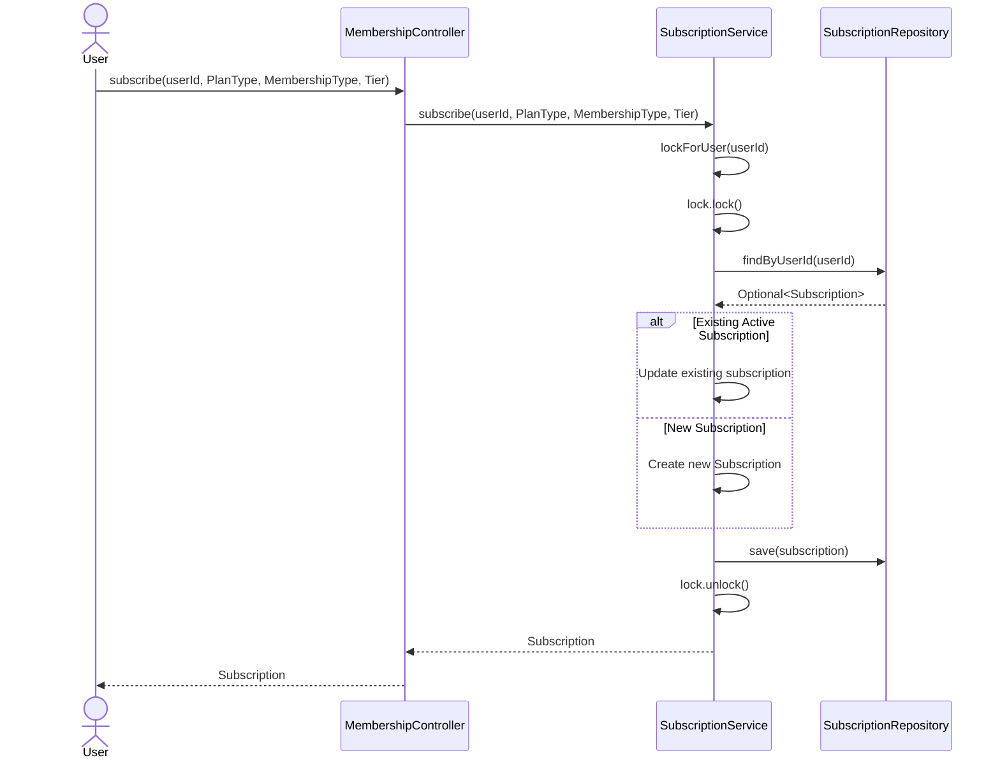
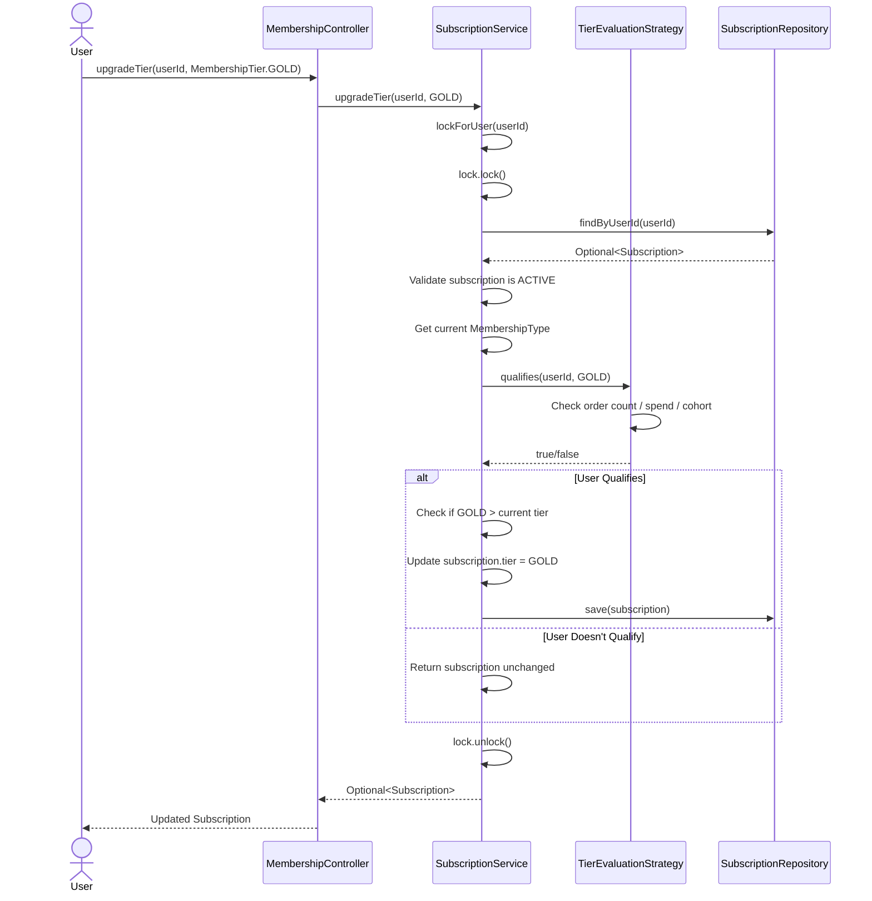
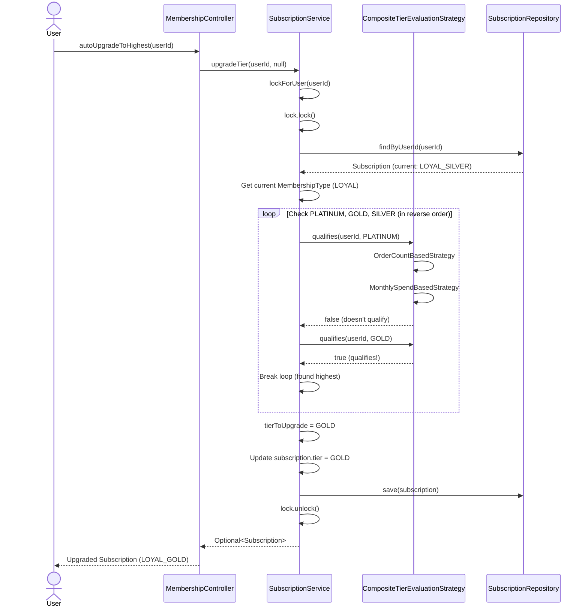
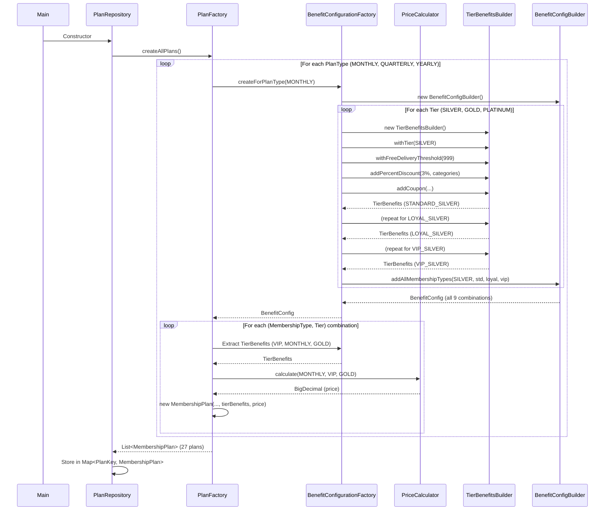
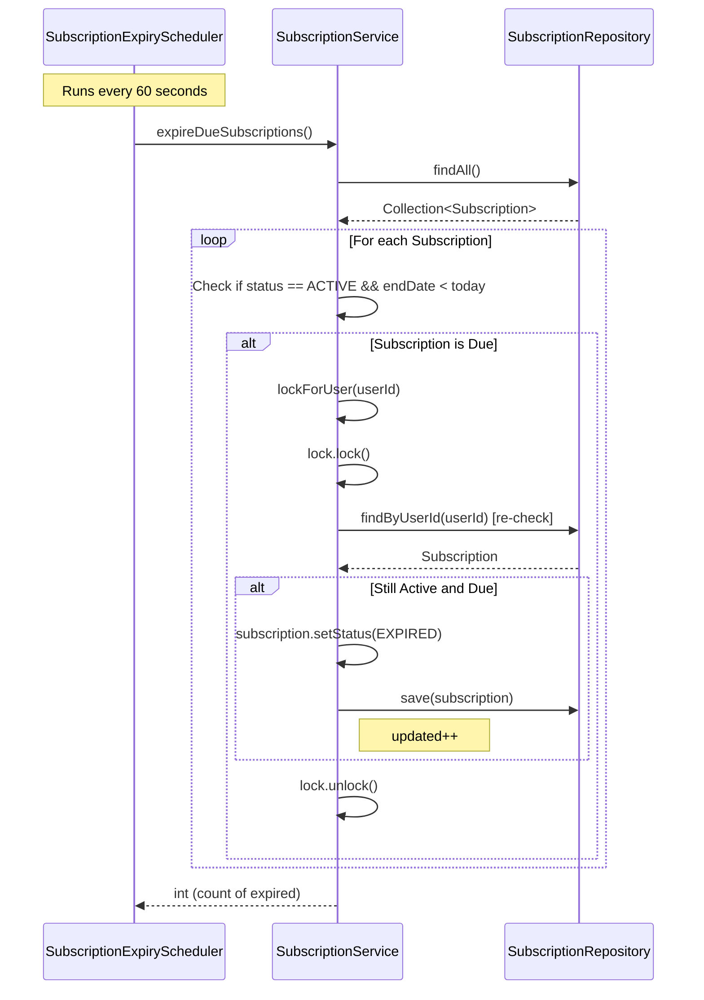
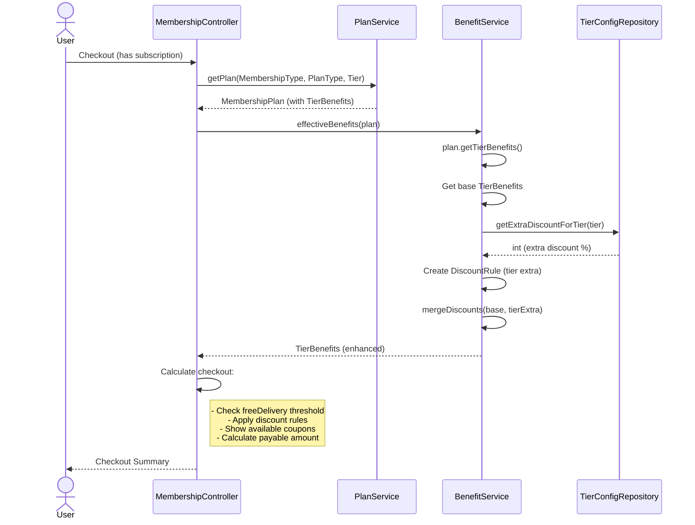
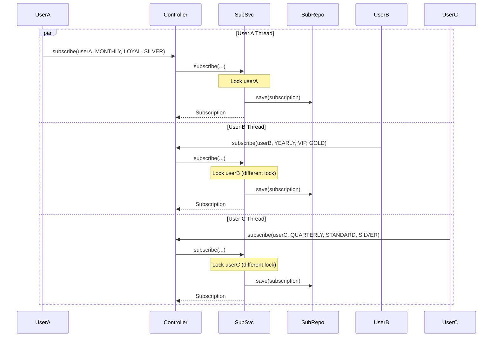
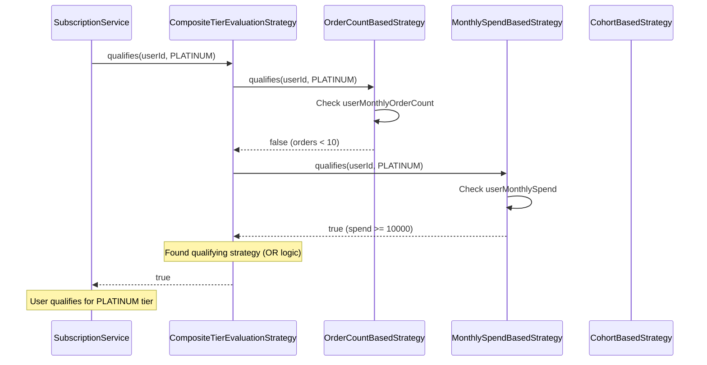

# Sequence Diagrams - Membership Program

## 📋 Table of Contents
1. [Subscribe Flow](#1-subscribe-flow)
2. [Tier Upgrade Flow](#2-tier-upgrade-flow)
3. [Auto-Upgrade Flow](#3-auto-upgrade-flow)
4. [Plan Creation Flow](#4-plan-creation-flow)
5. [Expiry Scheduler Flow](#5-expiry-scheduler-flow)
6. [Checkout with Benefits Flow](#6-checkout-with-benefits-flow)

---

## 1. Subscribe Flow

---

## 2. Tier Upgrade Flow

---

## 3. Auto-Upgrade Flow

---

## 4. Plan Creation Flow

---

## 5. Expiry Scheduler Flow

---

## 6. Checkout with Benefits Flow

---

## 🔄 Concurrent User Flow

**Key Point**: Each user has a separate lock, allowing concurrent operations for different users while preventing race conditions for the same user.

---

## 📊 Tier Evaluation Strategy Flow

---

## 🎯 Summary

These sequence diagrams show:
1. **Synchronous flows**: Subscribe, Upgrade, Checkout
2. **Background processes**: Expiry scheduler
3. **Complex creation**: Plan factory with builders
4. **Concurrent operations**: Multiple users simultaneously
5. **Strategy pattern**: Tier evaluation with multiple strategies

Each flow demonstrates proper locking, error handling, and clean separation of concerns.

